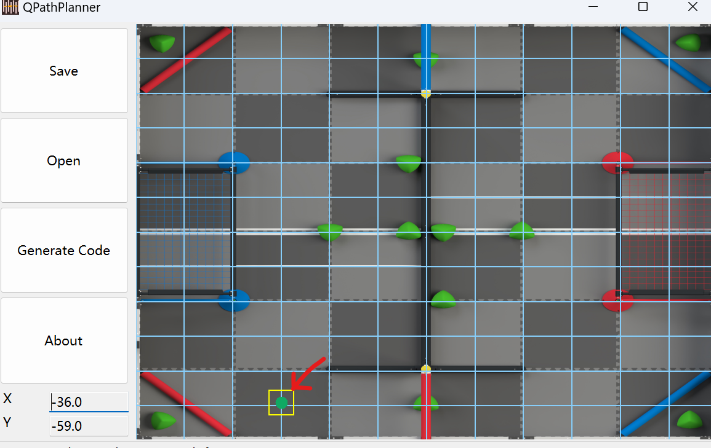
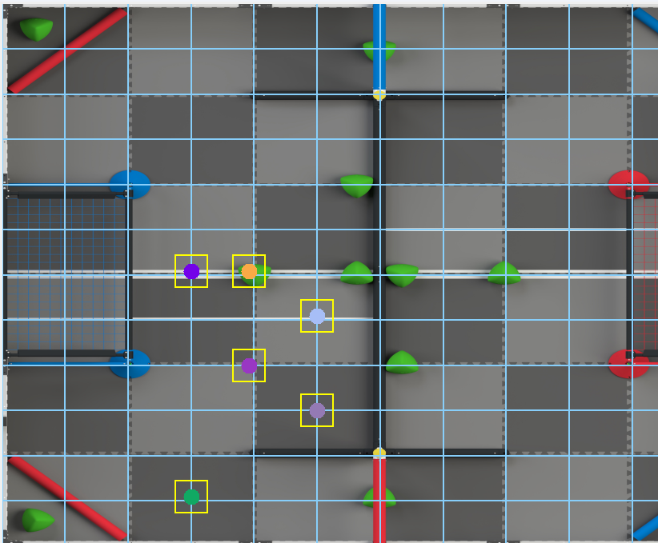
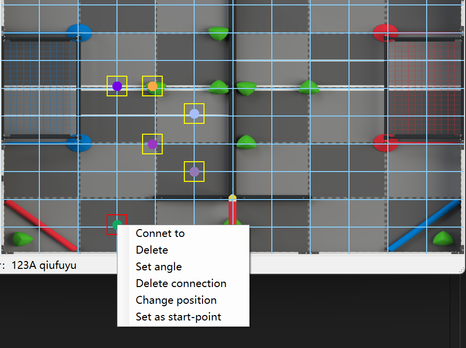
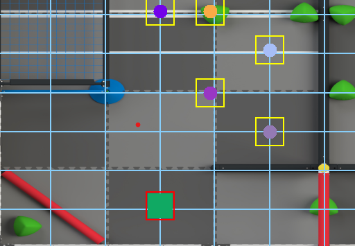
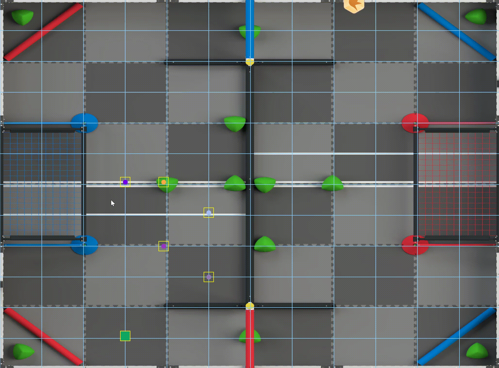
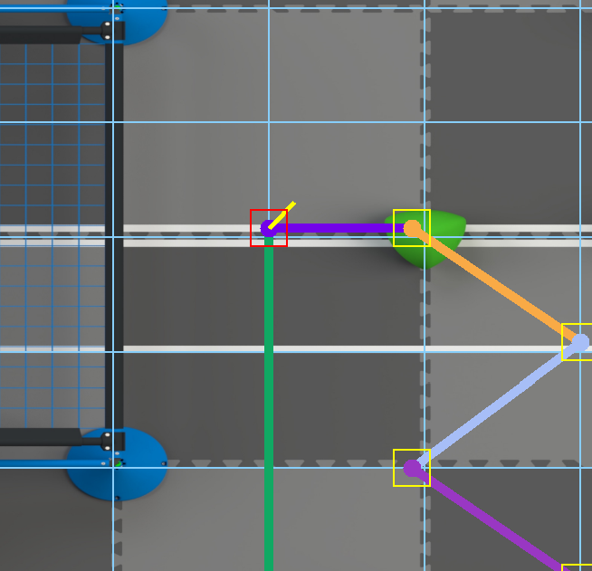
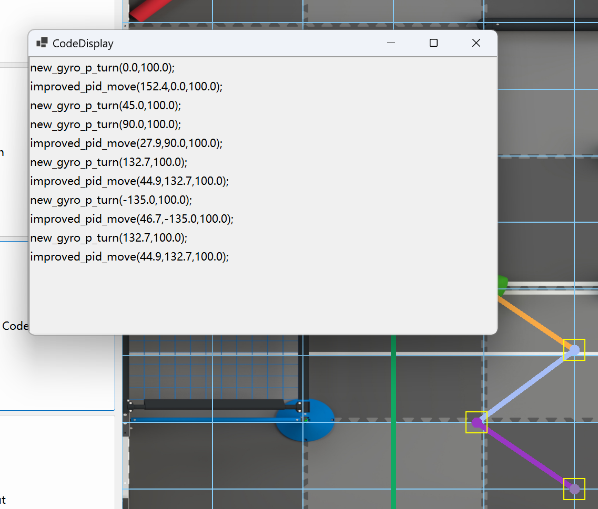

# QPathPlanner

Welcome to QPathPlanner! This Open-source winform(c#) project aims to create a convenient tool to plan the autonomous path for VEX robots  

QPathPlanner gets its inspiration from FRC's PathPlanner  

## License

This project is licensed under the MIT license.

## features:  

 - Real game map view
 - Absolute coordinate system
 - Auto code-generation

## Tutorials

### Requirements
 - Windows 7+ (8,10,11)
 - x86_64 arch

### Mark nodes
  
LEFT click on the canvas to create a new node  
In order to plan a path, you need several extra nodes...  
For example:  
  


### Set a start point

- right click one node
- select `set as startpoint`  

For example:  



After setting, your start point should look like a filled-square

### Connet your nodes

- right click one node
- select `connect to`  
- left click another node
- repeat until you connect all the nodes



### You can save/load your path at any time
- click `save` button
- click `open` button

### Control your heading
- right click on a node
- select `Set angle`
- input your angle



### Customize your own code
- open `config.txt`
- modify the code prototype as your own code template
```
{
    "abs":{

    },
    "delta":{
        "turn":"new_gyro_p_turn($angle,$speed)",
        "fwd":"improved_pid_move($distance,$angle,$speed)"
    }
}
```

### Click Generate path

You get it!  